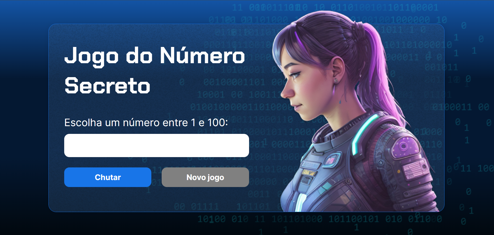

<h1>Jogo do Número Secreto 💭❓</h1>

<h2>📜 Sobre</h2>

Projeto desenvolvido durante os cursos introdutórios à lógica de programação da Alura.

Nele, está presente um jogo onde a máquina escolherá um número aleatório dentro do intervalo estabelecido e pedirá para o usuário
tentar adivinhá-lo; a cada tentativa, será dada uma dica ao jogador. Ao fim, será exibida uma mensagem de parabéns e o número de tentativas
necessárias para vencer o jogo.

<h2>💻 Tecnologias</h2>

    
    
    

<h2>👁️ Preview</h2>

<h2>🤝 Desenvolvido por</h2>

João Faverão
